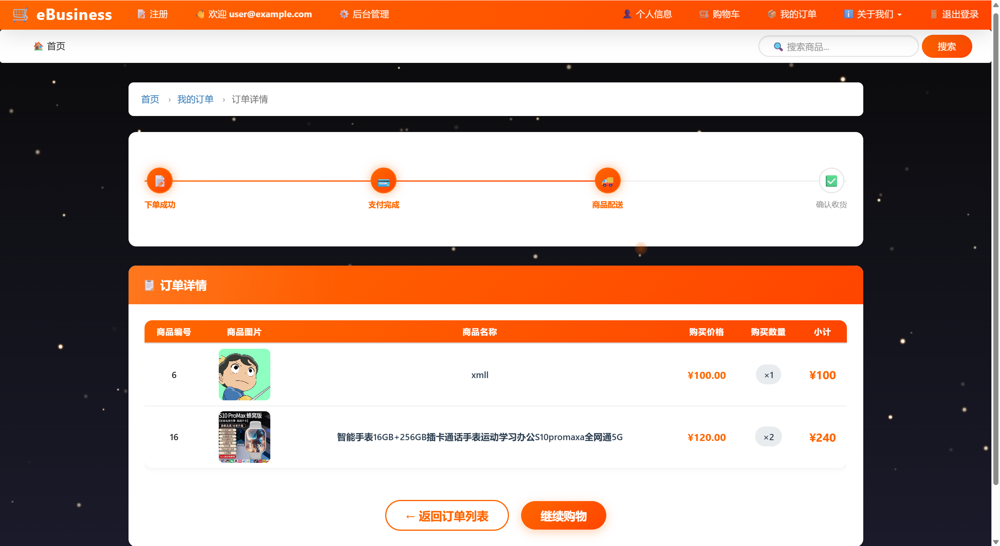
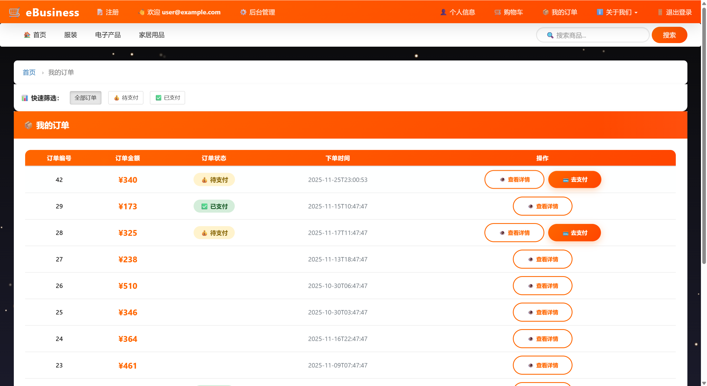
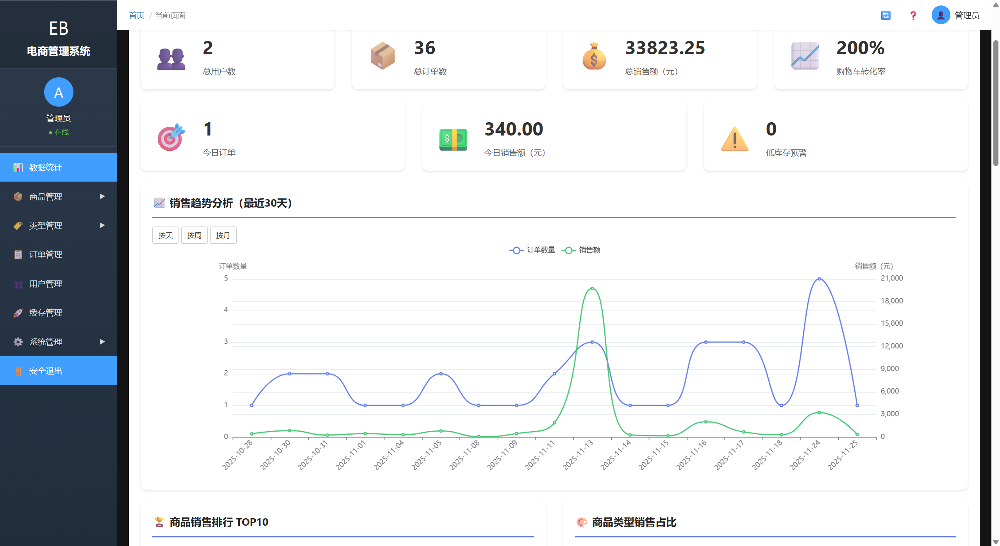
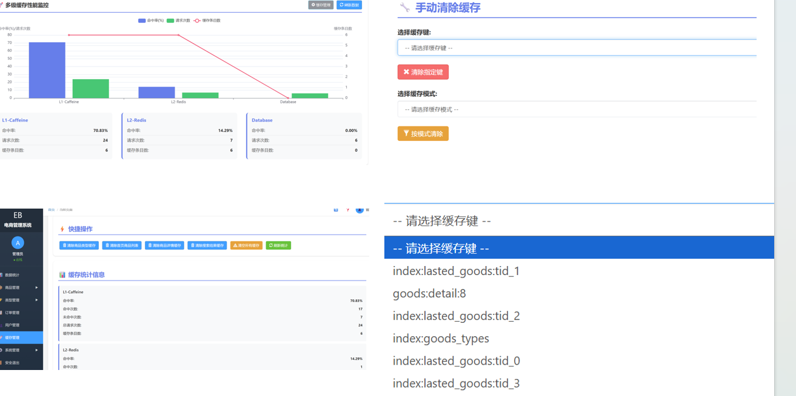
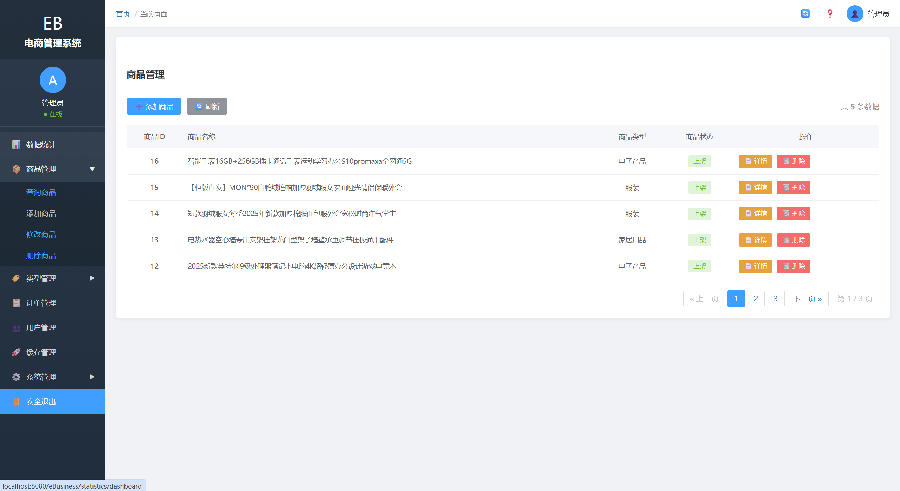
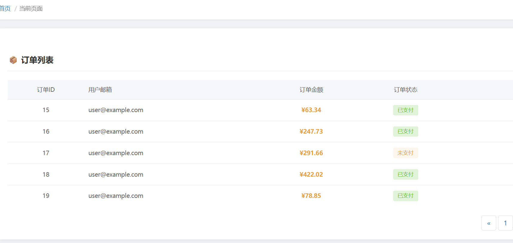
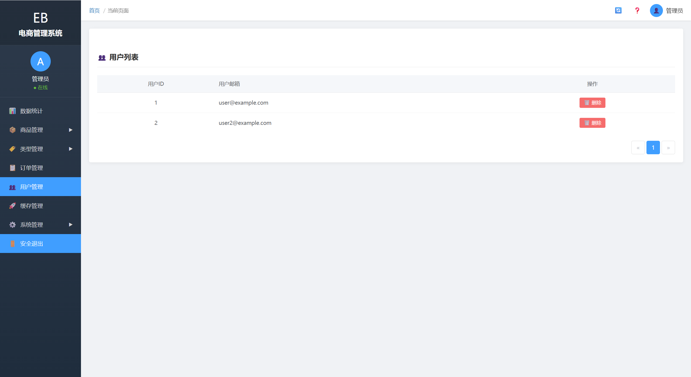
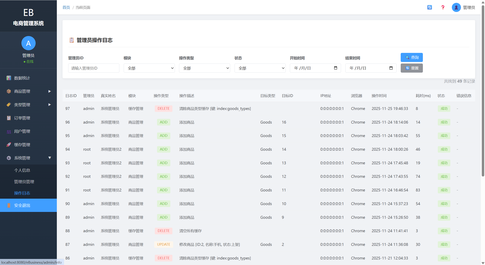
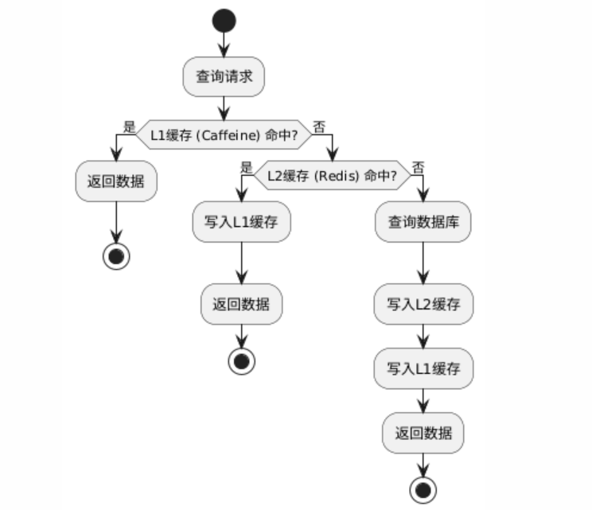
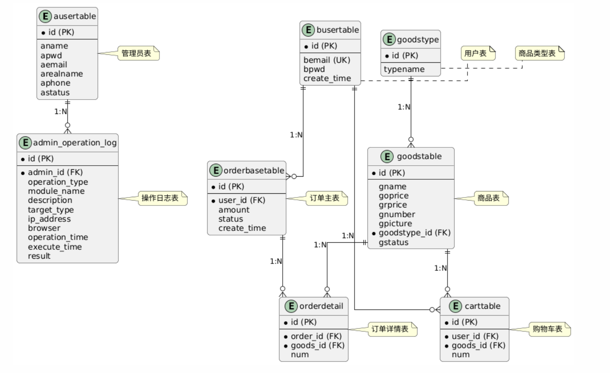

#  eBusiness 电商平台

<div align="center">

 


一个基于 Spring Boot 的现代化电商平台，集成了双层缓存、分布式锁、权限管理等企业级特性。

---

## ✨ 项目特色

### 🎨 现代化 UI 设计
- 🎪 **首页轮播图** - Swiper.js 实现的流畅轮播效果
- 🎭 **渐变色系** - Element Plus 风格的视觉设计
- ✨ **粒子特效** - 增强用户交互体验
- 📱 **响应式布局** - Bootstrap 网格系统，完美适配各种设备

### ⚡ 高性能缓存架构
- 🚀 **Redis 分布式缓存** - 商品、订单、用户数据缓存
- 💾 **Caffeine 本地缓存** - L1 缓存，减少网络开销
- 🔄 **缓存管理界面** - 可视化监控与一键清理
- 📈 **缓存统计** - 实时查看命中率、内存占用

### 🔐 企业级安全特性
- 🛡️ **Spring Security** - 基于角色的权限控制（RBAC）
- 🔑 **BCrypt 加密** - 密码安全存储
- 📝 **操作日志** - AOP 实现的完整审计日志
- 🚫 **验证码保护** - 防止暴力破解

### 🎯 并发控制
- 🔒 **Redis 分布式锁** - 防止超卖问题
- ♻️ **自动重试机制** - 提高订单成功率
- 💰 **BigDecimal 精度** - 金额计算准确无误

## 🎯 功能模块

### 👥 用户端功能

<table>
<tr>
<td width="50%">

#### 🛍️ 商品浏览
- 首页轮播图展示
- 商品分类筛选
- 关键词搜索
- 商品详情查看
- 新品标签展示

#### 🛒 购物流程
- 添加购物车
- 购物车管理
- 订单结算
- 在线支付
- 订单查询

#### 👤 用户中心
- 用户注册/登录
- 个人信息管理
- 我的订单
- 订单详情
- 收藏管理

#### 💳 支付系统
- 订单金额计算
- 库存实时校验
- 并发下单控制
- 支付状态跟踪

### 🔧 管理端功能

####  📊 数据看板

- 销售统计图表
- 商品销售排行
- 订单趋势分析
- 用户增长曲线
- 实时数据刷新

#### 📦 商品管理
- 商品增删改查
- 图片上传预览
- 商品状态管理
- 类型分类管理
- 批量操作

#### 📋 订单管理
- 订单列表查询
- 订单状态更新
- 订单详情查看
- 多条件筛选

#### 👨‍💼 系统管理
- 管理员管理
- 用户管理
- 操作日志查询
- 缓存管理
- 权限配置

## 🏗️ 技术架构

### 系统架构图

```
┌─────────────────────────────────────────────────────────────┐
│                         前端展示层                            │
│  Thymeleaf + Bootstrap + jQuery + Swiper.js + Particles.js  │
└──────────────────────┬──────────────────────────────────────┘
                       │ HTTP/HTTPS
┌──────────────────────▼──────────────────────────────────────┐
│                      Spring Boot 应用层                       │
│  ┌────────────┐  ┌────────────┐  ┌────────────────────┐    │
│  │ Controller │  │  Service   │  │   Security Filter  │    │
│  └─────┬──────┘  └─────┬──────┘  └──────────┬─────────┘    │
│        │               │                     │               │
│  ┌─────▼───────────────▼─────────────────────▼─────────┐   │
│  │              Spring Security 安全层                   │   │
│  │    认证 · 授权 · 会话管理 · 密码加密 · 操作日志       │   │
│  └───────────────────────────────────────────────────────┘   │
└──────────────────────┬──────────────────────────────────────┘
                       │
        ┌──────────────┼──────────────┐
        │              │              │
┌───────▼──────┐ ┌─────▼──────┐ ┌───▼────────┐
│  MySQL 8.0   │ │   Redis    │ │ Caffeine   │
│  持久化存储   │ │ 分布式缓存 │ │ 本地缓存   │
│ · 商品数据    │ │ · L2 缓存  │ │ · L1 缓存  │
│ · 订单数据    │ │ · 分布式锁 │ │ · 1000条   │
│ · 用户数据    │ │ · 会话存储 │ │ · 60分钟   │
└──────────────┘ └────────────┘ └────────────┘
```

### 核心技术栈

#### 后端技术
| 技术 | 版本 | 说明 |
|------|------|------|
| Spring Boot | 2.1.7.RELEASE | 核心框架 |
| Spring Security | 5.1.6 | 安全认证 |
| MyBatis | 2.1.0 | ORM 框架 |
| MySQL | 8.0.33 | 关系数据库 |
| Redis | Latest | 分布式缓存 |
| Caffeine | 2.8.0 | 本地缓存 |

#### 前端技术
| 技术 | 版本 | 说明 |
|------|------|------|
| Thymeleaf | 3.0.11 | 模板引擎 |
| Bootstrap | 3.3.7 | UI 框架 |
| jQuery | 3.3.1 | JavaScript 库 |
| Swiper | 4.3.5 | 轮播图组件 |
| ECharts | Latest | 图表库 |

#### 开发工具
- **Maven** - 项目构建
- **Lombok** - 简化代码
- **Jackson** - JSON 处理
- **Slf4j + Logback** - 日志管理

## 📸 项目截图

### 用户端界面🏠 首页轮播图


*全屏轮播图 + 最新商品展示*

#### 🛍️ 商品列表

*响应式商品卡片布局*

#### 📦 商品详情

*详细的商品信息与购买按钮*

#### 🛒 购物车

*实时计算总价，支持数量修改*

#### 💳 订单结算

*支付流程清晰直观*

#### 📋 我的订单

*订单状态实时更新*

### 管理端界面

#### 📊 数据看板


*ECharts 可视化数据统计*




#### 📦 商品管理

*商品增删改查，图片实时预览*

#### 📋 订单管理

*订单状态批量管理*

#### 👥 用户管理

*用户列表与状态控制*

#### 📝 操作日志

*完整的审计追踪*

> 💡 **提示**：将实际截图放入 `readmeImages/` 目录并更新对应文件名

## 🚀 快速开始

### 环境要求

- ☕ **JDK** 1.8+
- 🛢️ **MySQL** 8.0+
- 🔴 **Redis** 5.0+
- 🔨 **Maven** 3.6+

### 安装步骤

#### 1️⃣ 克隆项目

```bash
git clone https://gitee.com/lfenga/ebusiness.git
cd eBusiness
```

#### 2️⃣ 创建数据库

```bash
# 登录 MySQL
mysql -u root -p

# 创建数据库
CREATE DATABASE shop CHARACTER SET utf8mb4 COLLATE utf8mb4_general_ci;

# 导入数据
USE shop;
SOURCE sql/shop.sql;
```

#### 3️⃣ 配置 Redis

```bash
# 启动 Redis 服务
redis-server

# 或使用 Docker
docker run -d -p 6379:6379 redis:latest
```

#### 4️⃣ 修改配置文件

编辑 `src/main/resources/application.properties`：

```properties
# 数据库配置
spring.datasource.url=jdbc:mysql://localhost:3306/shop?useUnicode=true&characterEncoding=utf8&serverTimezone=Asia/Shanghai
spring.datasource.username=root
spring.datasource.password=your_password

# Redis 配置
spring.redis.host=localhost
spring.redis.port=6379
spring.redis.password=
```

#### 5️⃣ 启动项目

```bash
# Maven 启动
mvn spring-boot:run

# 或使用 IDE 运行主类
com.ch.ebusiness.EBusinessApplication
```

#### 6️⃣ 访问系统

- 🌐 **用户端**：http://localhost:8080/eBusiness/
- 🔧 **管理端**：http://localhost:8080/eBusiness/admin/toLogin

**默认管理员账号：**
- 用户名：`admin`
- 密码：`admin`

**测试用户账号：**
- 邮箱：`user@example.com`
- 密码：`123456`

## 💻 技术实现

### 🔥 核心功能实现

#### 1. 双层缓存架构

```java
// Caffeine L1 本地缓存
@Bean
public CaffeineCache caffeineCache() {
    return new CaffeineCache("goodsCache",
        Caffeine.newBuilder()
            .maximumSize(1000)
            .expireAfterWrite(60, TimeUnit.MINUTES)
            .build());
}

// Redis L2 分布式缓存
@Cacheable(value = "goods:detail", key = "#id")
public Goods getGoodsById(Integer id) {
    return goodsRepository.findById(id);
}
```

**缓存流程：**



#### 2. 分布式锁防超卖

```java
// Redis 分布式锁实现
public boolean tryLock(String key, long expireTime) {
    String value = UUID.randomUUID().toString();
    Boolean success = redisTemplate.opsForValue()
        .setIfAbsent(key, value, expireTime, TimeUnit.SECONDS);
    return Boolean.TRUE.equals(success);
}

// 订单服务中使用
String lockKey = "order:lock:" + goodsId;
if (redisLockUtil.tryLock(lockKey, 10)) {
    try {
        // 检查库存
        // 创建订单
        // 扣减库存
    } finally {
        redisLockUtil.releaseLock(lockKey);
    }
}
```

#### 3. AOP 操作日志

```java
@Aspect
@Component
public class AdminLogAspect {
    
    @Around("@annotation(adminLog)")
    public Object around(ProceedingJoinPoint point, AdminLog adminLog) {
        long startTime = System.currentTimeMillis();
        
        try {
            Object result = point.proceed();
            // 记录成功日志
            saveLog(point, adminLog, "SUCCESS", 
                System.currentTimeMillis() - startTime);
            return result;
        } catch (Throwable e) {
            // 记录失败日志
            saveLog(point, adminLog, "FAIL", 
                System.currentTimeMillis() - startTime);
            throw e;
        }
    }
}
```

#### 4. BigDecimal 金额处理

```java
public class MoneyUtil {
    
    // 格式化金额：保留两位小数
    public static String format(BigDecimal amount) {
        return amount.setScale(2, RoundingMode.HALF_UP).toString();
    }
    
    // 乘法：单价 × 数量
    public static BigDecimal multiply(BigDecimal price, int quantity) {
        return price.multiply(new BigDecimal(quantity))
                   .setScale(2, RoundingMode.HALF_UP);
    }
    
    // 求和：计算订单总额
    public static BigDecimal sum(List<BigDecimal> amounts) {
        return amounts.stream()
                     .reduce(BigDecimal.ZERO, BigDecimal::add)
                     .setScale(2, RoundingMode.HALF_UP);
    }
}
```

#### 5. 图片上传与预览

```java
// 后端：动态路径处理
String projectPath = System.getProperty("user.dir");
String uploadPath = projectPath + File.separator + 
                   "src" + File.separator + 
                   "main" + File.separator + 
                   "resources" + File.separator + 
                   "static" + File.separator + 
                   "images" + File.separator;

// 前端：实时预览
function handleFilePreview(event) {
    const file = event.target.files[0];
    if (file) {
        const reader = new FileReader();
        reader.onload = function(e) {
            $('#imagePreview').attr('src', e.target.result).show();
        };
        reader.readAsDataURL(file);
    }
}
```

---

## 📊 数据库设计

### ER 图



### 核心表结构

<details>
<summary>📋 点击查看详细表结构</summary>

#### 商品表 (goodstable)
```sql
CREATE TABLE `goodstable` (
  `id` int(11) NOT NULL AUTO_INCREMENT,
  `gname` varchar(50) NOT NULL COMMENT '商品名称',
  `goprice` decimal(10,2) NOT NULL COMMENT '原价',
  `grprice` decimal(10,2) NOT NULL COMMENT '现价',
  `gnumber` int(11) NOT NULL COMMENT '库存',
  `gpicture` varchar(200) DEFAULT NULL COMMENT '图片',
  `goodstype_id` int(11) DEFAULT NULL COMMENT '类型ID',
  `gstatus` int(11) DEFAULT '1' COMMENT '状态：1上架 0下架',
  PRIMARY KEY (`id`),
  KEY `goodstype_id` (`goodstype_id`)
) ENGINE=InnoDB DEFAULT CHARSET=utf8mb4;
```

#### 订单主表 (orderbasetable)
```sql
CREATE TABLE `orderbasetable` (
  `id` int(11) NOT NULL AUTO_INCREMENT,
  `busertable_id` int(11) DEFAULT NULL COMMENT '用户ID',
  `amount` decimal(10,2) NOT NULL COMMENT '订单金额',
  `ostatus` int(11) DEFAULT '0' COMMENT '状态：0未付款 1已付款 2已发货',
  `create_time` datetime DEFAULT CURRENT_TIMESTAMP COMMENT '创建时间',
  PRIMARY KEY (`id`)
) ENGINE=InnoDB DEFAULT CHARSET=utf8mb4;
```

</details>

---

## 🔧 配置说明

### application.properties 核心配置

```properties
# ==================== 服务器配置 ====================
server.port=8080
server.servlet.context-path=/eBusiness

# ==================== 数据源配置 ====================
spring.datasource.url=jdbc:mysql://localhost:3306/shop?useUnicode=true&characterEncoding=utf8&serverTimezone=Asia/Shanghai
spring.datasource.username=root
spring.datasource.password=your_password

# ==================== MyBatis 配置 ====================
mybatis.mapper-locations=classpath:mappers/*.xml
mybatis.type-aliases-package=com.ch.ebusiness.entity

# ==================== Redis 配置 ====================
spring.redis.host=localhost
spring.redis.port=6379
spring.redis.timeout=5000

# ==================== 缓存配置 ====================
spring.cache.caffeine.spec=maximumSize=1000,expireAfterWrite=60m

# ==================== 静态资源配置 ====================
spring.resources.cache.period=0
spring.servlet.multipart.max-file-size=10MB
```

---

## 📝 API 文档

### 用户端 API

| 接口 | 方法 | 说明 | 参数 |
|------|------|------|------|
| `/` | GET | 首页 | `tid` (可选) |
| `/goodsDetail` | GET | 商品详情 | `id` |
| `/cart/selectCart` | GET | 购物车列表 | - |
| `/cart/addCart` | POST | 添加购物车 | `goodsId`, `num` |
| `/cart/myOder` | GET | 我的订单 | `page` |
| `/cart/pay` | POST | 提交订单 | `goodsIds[]`, `nums[]` |

### 管理端 API

| 接口 | 方法 | 说明 | 参数 |
|------|------|------|------|
| `/admin/dashboard` | GET | 数据看板 | - |
| `/admin/selectGoods` | GET | 商品列表 | `page` |
| `/admin/addGoods` | POST | 添加商品 | Goods对象 |
| `/admin/updateGoods` | POST | 更新商品 | Goods对象 |
| `/admin/allOrder` | GET | 订单列表 | `page` |
| `/admin/cacheManagement` | GET | 缓存管理 | - |

---

## 📁 项目结构

```
eBusiness/
├── src/
│   ├── main/
│   │   ├── java/
│   │   │   └── com/ch/ebusiness/
│   │   │       ├── annotation/          # 自定义注解
│   │   │       ├── aspect/              # AOP切面
│   │   │       ├── config/              # 配置类
│   │   │       ├── controller/          # 控制器
│   │   │       ├── dto/                 # 数据传输对象
│   │   │       ├── entity/              # 实体类
│   │   │       ├── repository/          # 数据访问层
│   │   │       ├── service/             # 业务逻辑层
│   │   │       ├── util/                # 工具类
│   │   │       └── EBusinessApplication.java
│   │   └── resources/
│   │       ├── application.properties   # 配置文件
│   │       ├── mappers/                 # MyBatis映射
│   │       ├── static/                  # 静态资源
│   │       └── templates/               # 模板文件
│   └── test/
├── sql/                                 # 数据库脚本
├── readmeImages/                        # README图片
└── pom.xml                              # Maven配置
```

---

## ⭐ Star History

如果这个项目对你有帮助，请给个 Star ⭐ 支持一下！

